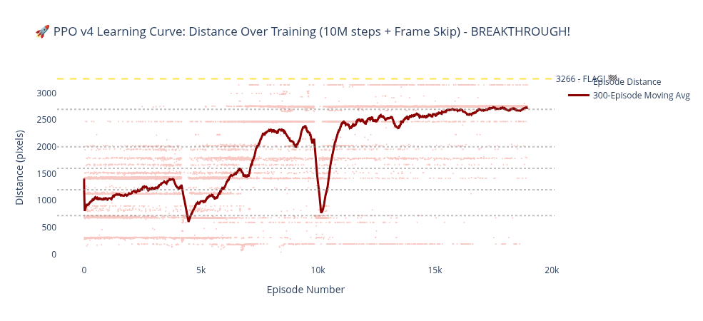

# 🎮 Mario RL Agent - Machine Learning Through Applied Practice

[](https://www.python.org/downloads/)
[](https://python-poetry.org/)
[](https://opensource.org/licenses/MIT)

> **Learning machine learning by building a reinforcement learning agent that masters Super Mario Bros**

A hands-on journey into deep reinforcement learning - training agents from scratch to play NES Super Mario Bros. Currently at **83% level completion** with PPO + frame skip optimization!

## 🚀 Latest Results: PPO v4 Breakthrough!

| Metric | Random | DQN (2M) | PPO v3 (10M) | **PPO v4 (10M+Skip)** |
|--------|--------|----------|--------------|----------------------|
| Avg Distance | 350 px | 1,024 px | 1,319 px | **2,725 px** 🏆 |
| Avg Reward | 380 | 1,920 | 2,025 | **6,210** 🏆 |
| vs Random | 1.0x | 2.9x | 3.8x | **7.8x** |
| Level Progress | 11% | 31% | 40% | **83%** |

**Key Insight:** Frame skip (4 frames/action) reduced jump chaining difficulty by 4x, enabling the agent to consistently clear obstacles that blocked previous versions.

## 🎬 Watch the Agents Play

### PPO v4 - Current Best (83% of level!)
<video src="https://github.com/user-attachments/assets/8ae63839-7a65-4ddf-b9db-e48a453a18d6" controls></video>

### PPO v3 - First to Beat DQN
<video src="https://github.com/user-attachments/assets/dc3092f0-26c7-4bbb-bd4e-68d59a023659" controls></video>

### DQN Baseline - Where It All Started
<video src="https://github.com/user-attachments/assets/f765d845-52cb-4506-ac57-c3cd909191ab" controls></video>

### PPO v1 - The Epic Failure (Policy Collapse)
<video src="https://github.com/user-attachments/assets/4f52663e-d855-44b7-b152-37f1d7b72339" controls></video>

*Learning from failure: This collapse taught us about proper callback logging and monitoring!*

## 📊 Training Visualizations

### Combined Learning Curves - The Frame Skip Breakthrough


*All agents compared on normalized training progress. PPO v4 (teal) shows dramatic improvement from frame skip.*

### PPO v4 Learning Curve


*18,985 episodes over 10M steps - consistent progress to ~2,700 pixels.*

### Distance Distribution Comparison


*Histogram showing where episodes end. PPO v4's distribution shifted far right of previous agents.*

### All Agents Box Plot


*Box plot comparing all five agents - PPO v4 shows both higher median and tighter consistency.*

## 📁 Project Structure

```
mlp/
├── src/                  # Source code
│   ├── environments/    # Game environment wrappers + preprocessing
│   │   ├── mario_env.py      # Environment factory with wrapper pipeline
│   │   ├── vec_mario_env.py  # Vectorized environments for parallel training
│   │   └── wrappers.py       # Custom wrappers (SkipFrame, RewardShaping, etc.)
│   ├── training/        # Training loops and callbacks
│   │   ├── train.py          # Main training orchestrator
│   │   └── callbacks.py      # W&B and database logging callbacks
│   └── utils/           # Helper functions
│       ├── config_loader.py  # YAML config loading
│       └── db_logger.py      # PostgreSQL experiment logging
├── configs/             # Hyperparameter configurations (YAML)
│   ├── dqn_baseline.yaml
│   ├── ppo_v2.yaml, ppo_v3.yaml, ppo_v4.yaml, ppo_v5.yaml
├── models/              # Saved model checkpoints
├── notebooks/           # Jupyter analysis notebooks
│   ├── 01_environment_exploration.ipynb
│   ├── 02_baseline_vs_dqn_comparison.ipynb
│   └── 03_ppo_vs_dqn_comparison.ipynb
├── scripts/             # Evaluation and testing scripts
├── database/            # SQL schemas and migrations
├── docs/                # Detailed documentation
│   ├── ProjectDocumentation.md  # Full architecture & progress
│   └── daily/          # Learning journal
└── .pre-commit-config.yaml
```

## 🛠️ Tech Stack

| Category | Tools |
|----------|-------|
| **Core ML** | PyTorch, Stable-Baselines3, Gymnasium, gym-super-mario-bros |
| **Tracking** | PostgreSQL, Weights & Biases, MLflow |
| **Development** | Poetry, Docker, GitHub Actions, pytest |

## 📚 Documentation

- **[Project Architecture](docs/ProjectDocumentation.md)** - Comprehensive overview, all phases, detailed results
- **[Daily Learning Log](docs/daily/)** - Day-by-day progress and insights
- **[Jupyter Notebooks](notebooks/)** - Interactive analysis with code

## 🎯 Project Journey

| Phase | Status | Key Achievement |
|-------|--------|-----------------|
| 1. Environment Setup | ✅ | PostgreSQL + W&B + Poetry infrastructure |
| 2. Baseline Agent | ✅ | Random baseline with 13 metrics |
| 3. DQN Training | ✅ | 5.3x improvement over random |
| 4. PPO Implementation | ✅ | Learned from policy collapse failure |
| 5. Reward Shaping & Frame Skip | ✅ | **7.8x improvement, 83% level progress** |
| 6. Imitation Learning | 🔜 | Next: Learn from demonstrations |
| 7. Production & CI/CD | 📋 | Planned |

## 🎯 Long-term Goal

Apply these ML techniques to cybersecurity: Suricata rule generation, intelligent incident reporting, and threat detection.

## 📝 License

MIT License - feel free to learn from this project!

---

_"The best way to learn machine learning is by building something real."_
