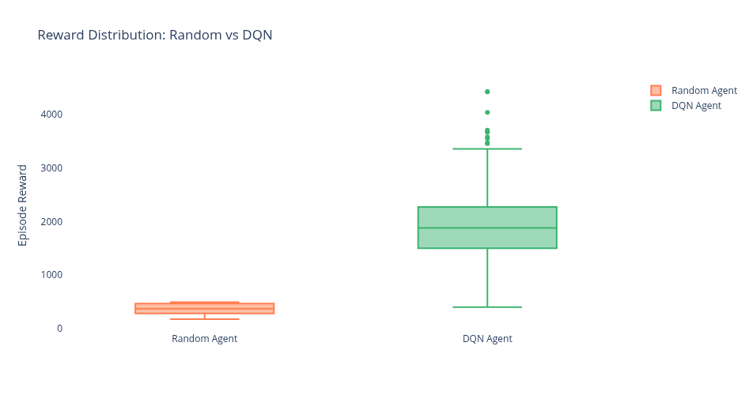

# 🎮 Mario RL Agent - Machine Learning Through Applied Practice

[](https://www.python.org/downloads/)
[](https://python-poetry.org/)
[](https://opensource.org/licenses/MIT)

> **Learning machine learning by building a reinforcement learning agent that masters Super Mario Bros**

## 🎯 Project Overview

This project represents my hands-on journey into machine learning through practical application. Rather than starting with pure theory, I'm building a deep reinforcement learning agent capable of learning to play Super Mario Bros from scratch - demonstrating fundamental ML concepts including neural networks, training pipelines, experiment tracking, and model evaluation.

**Why Mario?** It's the perfect learning environment: complex enough to be challenging, simple enough to understand, and engaging enough to stay motivated. Plus, the skills transfer directly to real-world applications.

**Long-term Goal:** Apply these ML techniques to cybersecurity challenges, specifically Suricata rule generation and intelligent incident reporting systems.

## 🚀 Key Features

- **Deep Reinforcement Learning**: Implementation of DQN and PPO algorithms
- **Experiment Tracking**: MLflow and Weights & Biases integration for reproducible research
- **Production-Ready Pipeline**: Dockerized training environment with CI/CD
- **Comprehensive Documentation**: Detailed notes on architecture decisions and learning process
- **Data-Driven Analysis**: PostgreSQL storage with Jupyter notebook visualizations

## 📁 Project Structure

```
mlp/
├── src/                  # Source code
│   ├── agents/          # RL agent implementations (planned)
│   ├── environments/    # Game environment wrappers + preprocessing
│   │   ├── mario_env.py
│   │   ├── vec_mario_env.py
│   │   └── wrappers.py
│   ├── models/          # Neural network architectures (planned)
│   ├── training/        # Training loops and callbacks
│   │   ├── train.py
│   │   └── callbacks.py
│   └── utils/           # Helper functions
│       ├── config_loader.py
│       └── db_logger.py
├── configs/             # Hyperparameter configurations (YAML)
│   ├── dqn_baseline.yaml
│   └── ppo_baseline.yaml
├── models/              # Saved model checkpoints
│   └── dqn_baseline_world1-1_final.zip
├── notebooks/           # Jupyter analysis notebooks
│   ├── 01_environment_exploration.ipynb
│   └── 02_baseline_vs_dqn_comparison.ipynb
├── scripts/             # Testing and exploration scripts
│   ├── random_agent.py
│   ├── evaluate_model.py
│   └── test_explore_env.py
├── database/            # SQL schemas and migrations
│   ├── schema.sql
│   └── schema_migration_01.sql
├── docs/                # Project documentation (Obsidian vault)
│   ├── ProjectDocumentation.md
│   └── daily/          # Learning journal
├── tests/              # Unit tests (planned)
├── docker/             # Container configurations (planned)
├── CLAUDE.md           # Instructions for Claude Code
└── .pre-commit-config.yaml  # Code quality automation
```

## 🛠️ Tech Stack

**Core ML**

- PyTorch - Deep learning framework
- Stable-Baselines3 - RL algorithms
- Gymnasium - Environment interface
- gym-super-mario-bros - NES Mario environment

**Data & Infrastructure**

- PostgreSQL - Experiment metadata
- MLflow - Model versioning
- Weights & Biases - Real-time metrics
- DVC - Data version control

**Development**

- Poetry - Dependency management
- Docker - Containerization
- GitHub Actions - CI/CD
- pytest - Testing framework

## 📚 Documentation

- **[Project Architecture](docs/ProjectDocumentation.md)** - Comprehensive project overview, tech stack, and implementation phases
- **[Daily Learning Log](docs/daily/)** - Day-by-day progress and insights
- **[GitHub Repository](https://github.com/BrendonJL/mlp)** - Source code and version history

## 🎓 Learning Objectives

- [x] Set up production-grade ML project structure ✅
- [x] Configure PostgreSQL for experiment tracking ✅
- [x] Implement database schema design with relational integrity ✅
- [x] Establish baseline metrics for RL environments ✅
- [x] Build preprocessing pipelines for game state observations ✅
- [x] Integrate cloud experiment tracking (Weights & Biases) ✅
- [x] Master reinforcement learning fundamentals (DQN concepts) ✅
- [x] Train deep RL agent with neural networks (CnnPolicy) ✅
- [x] Implement reproducible experiment configurations (YAML) ✅
- [x] Build evaluation and analysis pipelines ✅
- [x] Implement PPO with parallel environments ✅
- [ ] Reward shaping and hyperparameter tuning
- [ ] Imitation learning techniques
- [ ] Deploy containerized ML applications
- [ ] Apply ML to real-world security problems

## 🚧 Current Status

**✅ Phase 1: Environment Setup** (Complete - Dec 26-29, 2025)

The foundation is solid! Completed in 3 days:
- ✅ Project structure with Poetry dependency management
- ✅ Git workflow and GitHub integration
- ✅ Obsidian documentation system with daily logs
- ✅ PostgreSQL database with 4-table schema design
- ✅ Weights & Biases cloud experiment tracking
- ✅ Pre-commit hooks for automated code quality

**✅ Phase 2: Baseline Agent** (Complete - Dec 30-31, 2025)

Production-quality baseline established:
- ✅ Random agent implementation with 10-episode baseline run
- ✅ Enhanced metrics tracking (13 comprehensive values)
- ✅ Frame preprocessing pipeline (grayscale, resize, normalize, frame stack)
- ✅ Weights & Biases cloud logging with authentication
- ✅ PostgreSQL schema migration for episode metrics
- ✅ Jupyter notebook for environment exploration
- ✅ Success criteria defined for Phase 3 (x_pos > 434, score ≥ 100, flag_get = True)

**Baseline Performance:**
- Average reward: ~380
- Max distance (x_pos): 434
- Level completions: 0/10 (expected for random)
- Episode length: 1000 steps (always timeout)

**✅ Phase 3: Simple RL Algorithm** (Complete - Jan 2-4, 2026)

**Major Achievement:** Successfully trained a DQN agent that performs **5.3x better** than random baseline!

**Training Results:**
- Average reward: **1920** (vs 360 random) - **5.33x improvement** 🎯
- Average distance: **1024 pixels** (vs 350 random) - **2.92x improvement** 🏃
- Average score: **590** (vs 40 random) - **14.76x improvement** 💰
- Training episodes: 785 episodes (~12 hours, 2M timesteps)
- Database metrics: 13 comprehensive values tracked per episode

**What the Agent Learned:**
- Consistent rightward movement (3x further than random)
- Jump on enemies (Goombas) for points
- Collect coins and power-ups
- Navigate basic obstacles

**Current Limitations:**
- Level completion: 0% (never reached the flag at 3266 pixels)
- Gets stuck at complex obstacle sequences
- Average progress: 1024 pixels (31% of level)

**Completed Deliverables:**
- ✅ Full DQN training pipeline with Stable-Baselines3
- ✅ Evaluation script with video recording (`scripts/evaluate_model.py`)
- ✅ Comparative analysis notebook (`notebooks/02_baseline_vs_dqn_comparison.ipynb`)
- ✅ 785 training episodes logged to PostgreSQL + Weights & Biases
- ✅ Gameplay video of trained agent

### 🎮 Watch the Trained Agent Play

 <video src="https://github.com/user-attachments/assets/f765d845-52cb-4506-ac57-c3cd909191ab" controls></video>

  *DQN agent navigating World 1-1 - Notice how it jumps on enemies and moves consistently rightward!*

### 📊 Training Results Visualizations

**Performance Comparison: Random vs DQN**



*Box plot showing dramatic improvement in reward distribution. DQN agent (green) consistently achieves 5x higher rewards than random baseline (coral).*

**DQN Learning Curve**


*Agent performance over 785 training episodes. The 50-episode moving average (green) shows clear learning progression from ~600 to 2000+ reward. Individual episodes (blue dots) show exploration variance.*

**View the Analysis:**
- 📊 [Interactive Jupyter Notebook](notebooks/02_baseline_vs_dqn_comparison.ipynb) - Full analysis with code
- 📈 [Weights & Biases Dashboard](https://wandb.ai/blasley/mario-rl-agent) - Live training metrics

**Technical Highlights:**
- Fixed 29 integration bugs across training and evaluation
- Learned deterministic vs stochastic policy evaluation
- Built complete ML workflow: train → evaluate → analyze → iterate
- Achieved reproducibility with git hash + version tracking

**✅ Phase 4: PPO Baseline & Comparison** (Complete - Jan 10-11, 2026)

Implemented PPO with parallel environments - discovered critical issues:
- ✅ PPO configuration with parallel environments
- ✅ Vectorized environment wrapper (SubprocVecEnv)
- ✅ Multi-algorithm training script (supports DQN and PPO)
- ⚠️ Training completed but **policy collapsed** after 800k steps

### 🎮 Watch the Trained Agent Play

 <video src="https://github.com/user-attachments/assets/4f52663e-d855-44b7-b152-37f1d7b72339" controls></video>
 
 *PPO Agent Epicly Failing to Play Mario*

**Key Discovery: Policy Collapse**
- 800k checkpoint works (moves right, x=353)
- Final 2M model is broken (runs backwards into corner)
- Root cause: Callbacks only logged env[0], missing 7/8 of episode data
- No early warning system to detect collapse

**Lessons Learned:**
- 8 parallel envs at 90% CPU caused thermal throttling (10.2 hrs vs expected 4-5)
- PPO hyperparameters (LR=0.0001, entropy=0.01) likely too aggressive
- Monitoring infrastructure is critical - can't improve what you can't measure

See [ProjectDocumentation.md](docs/ProjectDocumentation.md) for complete timeline and detailed implementation phases.

### Recent Highlights

**Jan 11, 2026** - **Phase 4 Complete (with documented failure)** 📚 Analyzed PPO training results and discovered policy collapse. Agent learned correctly at 800k steps (moves right, x=353) but catastrophically forgot by 2M steps (runs backwards into corner). Identified two bugs: WandbCallback and DatabaseCallback only check `dones[0]`, missing 7/8 of episodes with vectorized environments. 8 parallel envs at 90% CPU caused thermal throttling. Valuable lesson: proper monitoring is essential - we couldn't detect collapse in real-time. **Phase 5 will fix callbacks first, then tune hyperparameters and add reward shaping.** 📊

**Jan 10, 2026** - **PPO Implementation!** 🔄 Implemented PPO with 8 parallel environments for direct comparison with DQN. Built vectorized environment wrapper using SubprocVecEnv for true multiprocessing parallelism. Updated training script to support multiple algorithms dynamically. Tested pipeline with 10k and 50k timestep runs. Key learnings: on-policy vs off-policy data collection, actor-critic architecture, PPO health metrics (approx_kl, clip_fraction, explained_variance). 🚀

**Jan 4, 2026** - **PHASE 3 COMPLETE!** 🎉 Agent achieved 5.3x improvement over random baseline! Built evaluation script and comprehensive analysis notebook with interactive visualizations. Discovered agent learned meaningful strategies (rightward movement, enemy interaction, coin collection) but still struggles with level completion (0% success rate - reaches 31% of level). Key technical learning: deterministic vs stochastic policy evaluation. Fixed 13 additional bugs during evaluation development. Total Phase 3 impact: 29 bugs fixed, 500+ lines of code, complete ML workflow established (train → evaluate → analyze). Recorded gameplay video showing trained agent in action. **Phase 3 complete in 3 days!** 🚀

**Jan 3, 2026** - **HUGE MILESTONE!** After 3 hours of systematic debugging, achieved first successful end-to-end training run! Fixed 12 integration issues including module imports, config mismatches, API compatibility between old Gym and new Gymnasium, image format for PyTorch, and wrapper design. Built 5 custom wrappers following Single Responsibility Principle. Added git commit hash, Python version, and PyTorch version tracking for reproducibility. Database and wandb logging verified. Launched full 2M timestep training (785 episodes, ~12 hours). **DQN training successful!** 🚀

**Dec 31, 2025** - Phase 2 complete! Built comprehensive random baseline with 13 tracked metrics (x_pos, score, time, coins, life, status, flag_get, etc.), integrated wandb cloud tracking with authentication, extended database schema with 8 new episode metric columns, and established success criteria for Phase 3. Attempted video recording but encountered gym-super-mario-bros render limitations - pragmatically chose metrics-only approach. **Ready for DQN training!** 🚀

**Dec 29, 2025** - Designed and implemented complete database schema for ML experiment tracking. Learned SQL CREATE TABLE syntax, foreign key relationships, and the Entity-Attribute-Value pattern for flexible hyperparameter storage. Set up W&B and pre-commit hooks. Phase 1 complete! 🎉

## 🎯 Future Applications

The skills developed here will transfer to:

- **ML-Enhanced Suricata Rules** - Anomaly detection in network traffic
- **Intelligent Incident Management** - Alert correlation and prioritization
- **Threat Intelligence** - Automated IOC extraction and classification

## 📝 License

MIT License - feel free to learn from this project!

## 🤝 Connect

This is a learning project - feedback and suggestions welcome!

---

_"The best way to learn machine learning is by building something real."_
