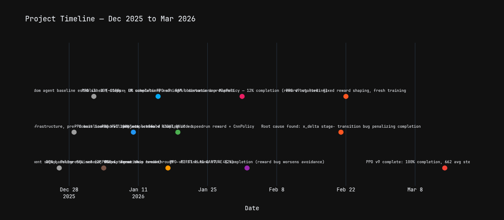
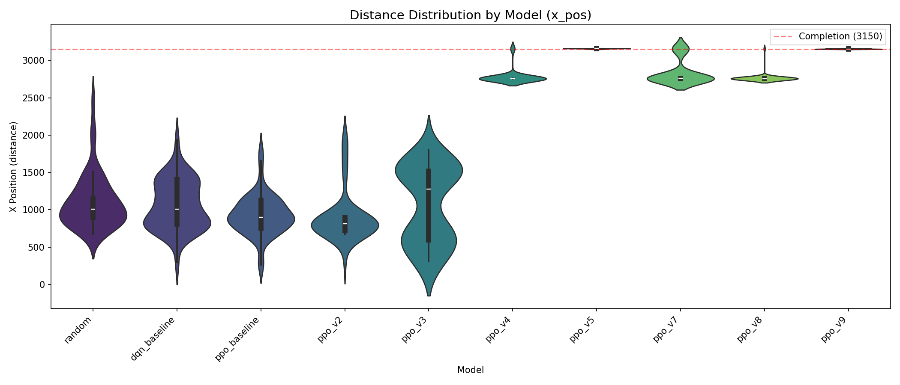
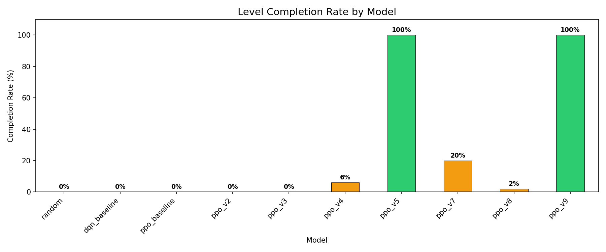
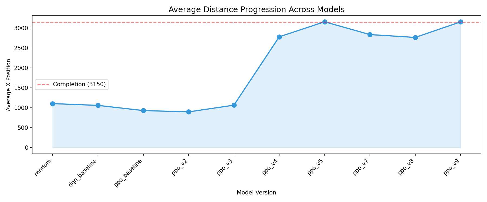
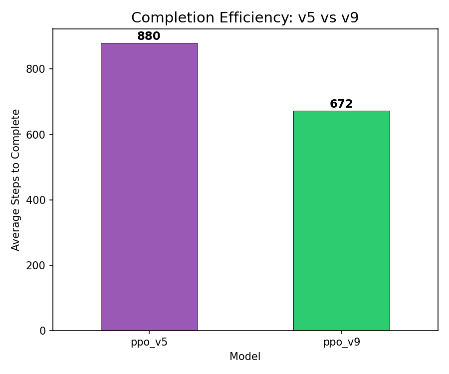
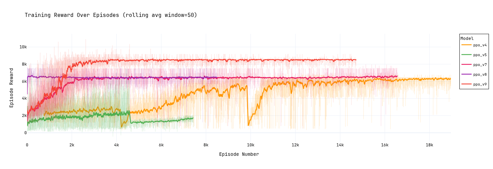
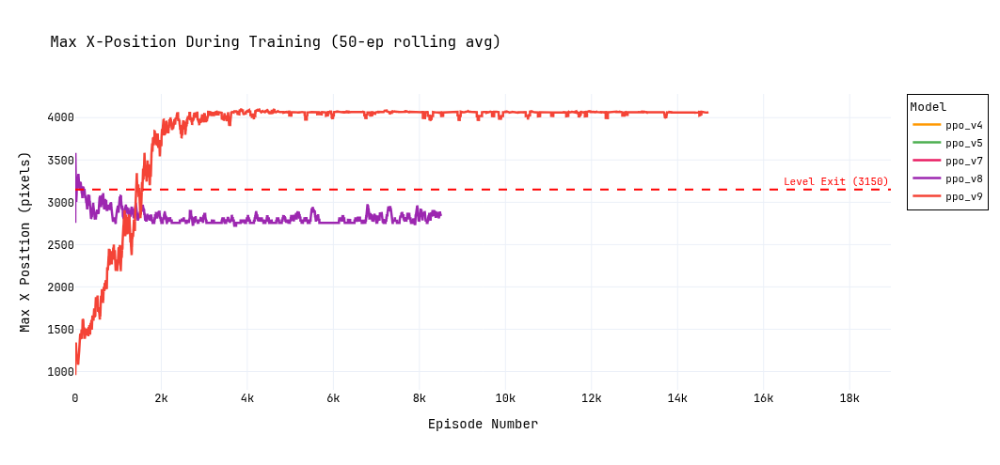
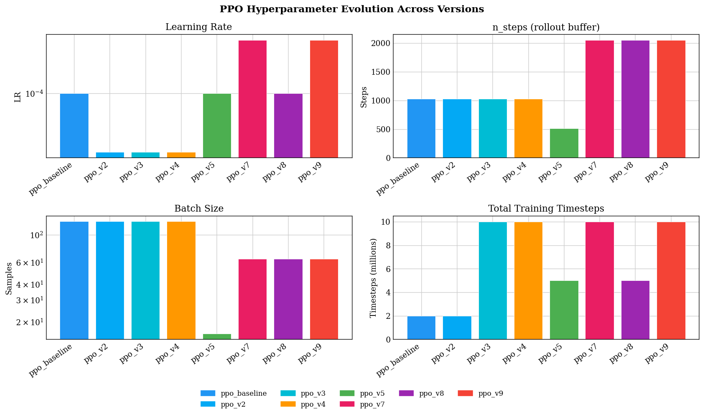

# Reinforcement Learning for Super Mario Bros: A Learning-Focused Study

[](https://www.python.org/downloads/)
[](https://pytorch.org/)
[](https://stable-baselines3.readthedocs.io/)
[](https://opensource.org/licenses/MIT)

> Training deep reinforcement learning agents from scratch to autonomously complete World 1-1 of Super Mario Bros — achieving **100% completion rate** across 50 evaluation episodes.

---

## Note on AI-Assisted Development

This project was built as a hands-on learning exercise in machine learning, reinforcement learning, and software engineering. **Claude (Anthropic)** served as an interactive instructor and coding partner throughout the ~3-month development process.

**How AI was used:**
- **Architectural guidance** — Claude suggested project structure, database schema design, and the overall phase-based development approach.
- **Debugging partner** — When training runs failed or models segfaulted, Claude helped diagnose root causes (e.g., identifying the reward shaping bug in v7/v8, the cross-machine model serialization issue).
- **Boilerplate and tooling** — Claude wrote infrastructure code: evaluation scripts, visualization pipelines, database queries, Jupyter notebook scaffolding, and documentation.
- **Teaching through questions** — Rather than providing solutions directly, Claude used Socratic questioning to guide implementation decisions (e.g., "What data structure would map model names to their configurations?").

**What I wrote and implemented myself:**
- **Core logic functions** — Key functions like `parse_results()`, `get_model_config()`, reward wrapper configurations, and training hyperparameter selections.
- **All training runs** — Executing, monitoring, and iterating on every experiment from random baseline through v9.
- **Design decisions** — Choosing between CNN/MLP policies, pixel/RAM observations, action spaces, and reward shaping strategies.
- **Debugging participation** — Identifying symptoms, running diagnostics, and implementing fixes with guidance.

The ratio was roughly **70% Claude / 30% me** on raw lines of code, but the learning value was in understanding *why* each decision was made — not just *what* code to write. Every major design choice went through discussion before implementation.

---

## Project Timeline



**Duration:** December 2025 — March 2026 (~12 weeks)

---

## Agent Progression Demo

All 10 models evaluated on World 1-1 (5 episodes each, rendered):

[Watch the full evaluation video](docs/images/MLP_AllModels_5Ep_Eval.mp4)

---

## Abstract

This project investigates the application of deep reinforcement learning (DRL) to the classic platformer Super Mario Bros (NES). Starting from a random baseline agent, we iteratively developed and evaluated 10 agent configurations spanning three algorithm families: random, Deep Q-Network (DQN), and Proximal Policy Optimization (PPO). Through systematic experimentation with observation representations (pixel vs. RAM), action space design, frame skipping, and reward shaping, two agents achieved **100% level completion** across 50 evaluation episodes. The final agent (PPO v9) completes World 1-1 in an average of **672 steps** using only 128 bytes of RAM state and a 1.4 MB model — demonstrating that compact state representations can outperform high-dimensional pixel inputs for structured environments.

---

## 1. Introduction

### 1.1 Motivation

Reinforcement learning provides a compelling framework for training autonomous agents in complex, sequential decision-making environments. Super Mario Bros serves as an ideal testbed: it features sparse rewards, delayed consequences, precise timing requirements, and a clear success metric (reaching the flagpole).

This project was undertaken as a practical learning exercise with a longer-term goal of applying ML techniques to cybersecurity applications — specifically Suricata rule generation, intelligent incident reporting, and network traffic anomaly detection. The skills developed here (experiment tracking, hyperparameter tuning, reward engineering, model evaluation) transfer directly to those domains.

### 1.2 Environment

| Property | Value |
| -------- | ----- |
| Game | Super Mario Bros (NES) via `gym-super-mario-bros` |
| Level | World 1-1 |
| Observation Space | 84x84x4 grayscale frames (pixel) or 128-byte RAM vector |
| Action Spaces | SIMPLE_MOVEMENT (7 actions) or RIGHT_ONLY (4 actions) |
| Reward Signal | Custom shaping (see Section 3) |
| Max Episode Length | 5,000 steps |

---

## 2. Methods

### 2.1 Algorithm Selection

Three algorithm families were evaluated:

- **Random Baseline** — Uniform random action selection. Establishes a performance floor.
- **DQN (Deep Q-Network)** — Value-based method with experience replay and target networks. CNN feature extractor over pixel observations.
- **PPO (Proximal Policy Optimization)** — Policy gradient method with clipped surrogate objective. Tested with both CNN (pixel) and MLP (RAM) architectures.

### 2.2 Hyperparameter Evolution

Each PPO version introduced targeted changes based on failures observed in prior runs:

| model | policy | obs_mode | action_space | frame_skip | reward_wrapper | learning_rate | n_steps | batch_size | n_epochs | clip_range | ent_coef | gae_lambda | gamma | n_envs | total_timesteps | lr_scheduler |
| :--- | :--- | :--- | :--- | :--- | :--- | ---: | :--- | ---: | :--- | :--- | :--- | :--- | ---: | :--- | ---: | :--- |
| dqn_baseline | CnnPolicy | pixel | SIMPLE_MOVEMENT | — | — | 0.0001 | — | 32 | — | — | — | — | 0.99 | — | 2,000,000 | False |
| ppo_baseline | CnnPolicy | pixel | SIMPLE_MOVEMENT | — | — | 0.0001 | 1024 | 128 | 5 | 0.2 | 0.01 | 0.95 | 0.99 | 8 | 2,000,000 | False |
| ppo_v2 | CnnPolicy | pixel | SIMPLE_MOVEMENT | — | — | 3e-05 | 1024 | 128 | 5 | 0.2 | 0.02 | 0.95 | 0.99 | 4 | 2,000,000 | False |
| ppo_v3 | CnnPolicy | pixel | SIMPLE_MOVEMENT | — | — | 3e-05 | 1024 | 128 | 10 | 0.15 | 0.02 | 0.95 | 0.99 | 4 | 10,000,000 | True |
| ppo_v4 | CnnPolicy | pixel | SIMPLE_MOVEMENT | 4 | — | 3e-05 | 1024 | 128 | 10 | 0.15 | 0.02 | 0.95 | 0.99 | 4 | 10,000,000 | True |
| ppo_v5 | CnnPolicy | pixel | RIGHT_ONLY | 4 | speedrun | 0.0001 | 512 | 16 | 10 | 0.2 | 0.01 | 1.0 | 0.9 | 4 | 5,000,000 | True |
| ppo_v7 | MlpPolicy | ram | SIMPLE_MOVEMENT | 4 | standard | 0.0003 | 2048 | 64 | 10 | 0.2 | 0.01 | 0.95 | 0.99 | 4 | 10,000,000 | True |
| ppo_v8 | MlpPolicy | ram | SIMPLE_MOVEMENT | 4 | standard | 0.0001 | 2048 | 64 | 10 | 0.2 | 0.01 | 0.95 | 0.99 | 4 | 5,000,000 | True |
| ppo_v9 | MlpPolicy | ram | SIMPLE_MOVEMENT | 4 | standard | 0.0003 | 2048 | 64 | 10 | 0.2 | 0.01 | 0.95 | 0.99 | 4 | 10,000,000 | True |

### 2.3 Key Design Decisions

**Frame Skipping (v4):** Repeating each action for 4 consecutive frames reduced the effective decision frequency, making jump sequences dramatically easier to learn. This single change increased average distance from 859px to 2,781px.

**RAM Observations (v7):** Switching from 84x84x4 pixel frames to the NES's 128-byte RAM vector reduced model size from ~20MB to ~1.4MB while providing direct access to game state variables (Mario's position, velocity, enemy locations). This eliminated the need for the CNN to learn spatial feature extraction.

**Reward Shaping (v9):** Versions 7 and 8 contained a critical bug in the `RewardShapingWrapper`: the x_delta calculation produced a large negative reward (~-315) at stage transitions when x_pos resets. The agent effectively learned to *avoid completing the level*. Version 9 fixed this with three changes:
1. Clamping x_delta to prevent spurious penalties at stage boundaries
2. Stage-based completion bonus (+500) triggered on `info["stage"]` transitions
3. Accumulated distance milestones replacing raw position deltas

### 2.4 Infrastructure

| Component | Purpose |
| --------- | ------- |
| PostgreSQL 16 | Experiment metadata, episode results, hyperparameters |
| Weights & Biases | Real-time training metrics and run comparison |
| Poetry + Distrobox | Dependency isolation (Python 3.13 in Fedora 43 container) |
| Jupyter Lab | Interactive training analysis |

---

## 3. Results

### 3.1 Final Evaluation Summary

All models evaluated over **50 episodes** on World 1-1 (SuperMarioBros-v3), max 5,000 steps per episode:

| Model | Avg Reward | Avg Distance | Max Distance | Completion % | Avg Steps | Avg Score | Avg Coins |
| :--- | ---: | ---: | ---: | ---: | ---: | ---: | ---: |
| random | 1,774.5 | 1,104 | 2,466 | 0% | 2,094 | 636 | 0.8 |
| dqn_baseline | 2,036.4 | 1,060 | 1,934 | 0% | 617 | 506 | 0.6 |
| ppo_baseline | 1,523.4 | 930 | 1,784 | 0% | 1,889 | 733 | 1.8 |
| ppo_v2 | 1,401.4 | 897 | 1,954 | 0% | 1,947 | 566 | 1.6 |
| ppo_v3 | 1,533.8 | 1,065 | 1,801 | 0% | 267 | 106 | 0.0 |
| ppo_v4 | 6,742.9 | 2,781 | 3,161 | 6% | 597 | 874 | 0.1 |
| **ppo_v5** | 1,722.8 | 3,159 | 3,161 | **100%** | 880 | 31,544 | 3.6 |
| ppo_v7 | 7,492.9 | 2,838 | 3,161 | 20% | 618 | 5,079 | 2.5 |
| ppo_v8 | 6,917.1 | 2,766 | 3,156 | 2% | 578 | 1,378 | 1.4 |
| **ppo_v9** | **8,520.3** | **3,156** | 3,161 | **100%** | **672** | 20,874 | **8.2** |

### 3.2 Distance Distribution



The violin plot reveals distinct behavioral clusters. Early models (random through v3) show wide distributions centered below 1,500px. Version 4 introduced a bimodal pattern — some episodes reaching near-completion while others stall early. Versions 5 and 9 show tight distributions pinned at the completion threshold (3,150+px).

### 3.3 Completion Rate Progression



Level completion emerged gradually: v4 achieved 6%, v7 reached 20%, and both v5 and v9 reached 100%. Notably, v8 (a fine-tuned v7) regressed to 2% — likely due to the reduced learning rate interacting poorly with the broken reward signal.

### 3.4 Distance Progression Across Models



Average distance follows a roughly monotonic improvement from random through v9, with two notable exceptions: the ppo_baseline and v2 performed *worse* than random (likely due to premature policy collapse), and v3 improved only marginally despite 10M training steps (without frame skipping, the agent couldn't learn effective jump timing).

### 3.5 Completion Efficiency: v5 vs v9



| Metric | ppo_v5 | ppo_v9 |
| :--- | :--- | :--- |
| Avg Reward | 1,722.8 | **8,520.3** |
| Avg Steps | 879.6 | **672.0** |
| Avg Distance | 3,158.5 | 3,155.6 |
| Avg Score | **31,544** | 20,874 |
| Avg Coins | 3.6 | **8.2** |
| Completion % | 100% | 100% |
| Policy | CnnPolicy | MlpPolicy |
| Observations | 84x84x4 pixels | 128-byte RAM |
| Model Size | ~20 MB | **~1.4 MB** |
| Action Space | RIGHT_ONLY (4) | SIMPLE_MOVEMENT (7) |

Both models achieve 100% completion, but through fundamentally different strategies:

- **v5** uses pixel observations with a restricted action space (RIGHT_ONLY). It scores higher in-game (31,544 vs 20,874) because it was trained with a speedrun reward wrapper that incentivizes speed, but takes **31% more steps** per episode.
- **v9** uses RAM observations with the full action space. It completes levels faster (672 vs 880 steps), collects more coins (8.2 vs 3.6), and achieves nearly 5x the reward — in a model **14x smaller**.

### 3.6 Training Reward and Distance Over Time





### 3.7 Hyperparameter Evolution



---

## 4. Discussion

### 4.1 The Frame Skip Breakthrough

The single most impactful change was introducing frame skipping in v4. Without it, the agent had to learn to hold the jump button for multiple consecutive frames — a sequence that's easy for humans but represents a challenging credit assignment problem for RL. By repeating each action for 4 frames, jump execution became a single decision rather than a multi-step sequence.

### 4.2 The Reward Shaping Bug

Versions 7 and 8 both suffered from a subtle but devastating bug: when Mario reaches the flagpole and transitions to stage 2, the `x_pos` value resets from ~3,150 to ~40. The reward wrapper computed this as a massive backward movement, penalizing the agent with approximately -315 reward for *winning*. The agent literally learned that completing the level was the worst possible outcome.

This bug was invisible in standard training metrics because the agent still appeared to be making forward progress — it simply stopped short of the flagpole. It was only discovered through careful analysis of per-episode reward breakdowns during Phase 6.

### 4.3 Pixel vs. RAM Observations

The comparison between v5 (pixel) and v9 (RAM) challenges the assumption that raw visual input is necessary for game-playing agents. For a game with a well-defined memory layout, direct RAM access provides:
- **14x model compression** (1.4 MB vs 20 MB)
- **Faster training convergence** (no CNN feature extraction to learn)
- **More robust generalization** (no sensitivity to visual rendering quirks)

The tradeoff is portability: RAM observation requires game-specific memory mapping, while pixel observations generalize across any visual environment.

### 4.4 Lessons Learned

1. **Reward engineering is the hardest part of RL.** Two months of apparently good training (v7, v8) were undermined by a single sign error in reward computation.
2. **Simpler is often better.** The smallest model (v9, 1.4 MB) with the simplest observations (128 bytes) outperformed every pixel-based approach.
3. **Frame skipping is not optional for platformers.** Without it, even 10M training steps couldn't learn consistent jump timing.
4. **Evaluation methodology matters.** The `flag_get` signal from the environment is unreliable — stage transition detection via `info["stage"]` proved more robust for completion detection.

---

## 5. Experiment Registry

| ID | Experiment | Algorithm | Status | Start | End | Notes |
| ---: | :--- | :--- | :--- | :--- | :--- | :--- |
| 14 | dqn_baseline_world1-1 | DQN | completed | 2026-01-03 | 2026-01-03 | First DQN training run |
| 15 | random_baseline_world1-1 | random | completed | 2026-01-04 | 2026-01-04 | Random baseline (10 episodes) |
| 35 | ppo_v2_world1-1 | PPO | completed | 2026-01-11 | 2026-01-11 | Reduced LR, increased entropy |
| 36 | ppo_v3_world1-1 | PPO | completed | 2026-01-13 | 2026-01-13 | 10M steps, LR scheduler |
| 38 | ppo_v4_world1-1 | PPO | completed | 2026-01-15 | 2026-01-17 | Frame skip breakthrough |
| 39 | ppo_v5_world1-1 | PPO | completed | 2026-01-17 | 2026-01-20 | RIGHT_ONLY + speedrun reward |
| 55 | ppo_v7_world1-1 | PPO | completed | 2026-01-23 | 2026-01-26 | RAM observations + MlpPolicy |
| 1 | ppo_v8_world1-1 | PPO | completed | 2026-02-21 | 2026-02-22 | Fine-tuned v7, fixed callbacks |
| 57 | ppo_v9_world1-1 | PPO | completed | 2026-02-22 | 2026-02-23 | Fixed reward shaping — 100% completion |

---

## 6. Project Structure

```
mlp/
├── src/
│   ├── environments/     # Game wrappers (SkipFrame, RewardShaping, RAM obs)
│   ├── training/         # Training loops, callbacks, checkpointing
│   └── utils/            # Config loading, database logging
├── configs/              # YAML hyperparameter configs (v2–v9)
├── models/               # Saved model checkpoints (.zip)
├── notebooks/            # Jupyter training analysis
├── scripts/              # Evaluation, visualization, model recovery
├── database/             # SQL schemas and migrations
├── docker/               # Docker build context
├── docs/
│   ├── daily/            # Day-by-day learning logs
│   ├── images/           # Plots, videos, timeline
│   │   └── eval/         # Final evaluation charts
│   ├── notebook/         # Exported notebook visualizations
│   └── tables/           # Exported evaluation tables
├── Dockerfile            # Reproducible training environment
└── README.md
```

## Technology Stack

| Category | Tools |
| -------- | ----- |
| **Core ML** | PyTorch, Stable-Baselines3, Gymnasium, gym-super-mario-bros |
| **Experiment Tracking** | PostgreSQL 16, Weights & Biases |
| **Analysis** | Jupyter Lab, Plotly, Matplotlib, Seaborn, Pandas |
| **Development** | Poetry, Distrobox (Fedora 43), pre-commit hooks |
| **Code Quality** | Ruff, Pyright, Black |

## Documentation

- **[Project Architecture & Phase History](docs/ProjectDocumentation.md)** — Detailed phase documentation and architectural decisions
- **[Daily Learning Logs](docs/daily/)** — Day-by-day progress, failures, and insights
- **[Training Analysis Notebook](notebooks/training_analysis.ipynb)** — Interactive visualizations and database queries
- **[Evaluation Results (Raw)](docs/evaluation_results.md)** — Full 50-episode evaluation data

## Future Directions

The techniques developed here — experiment tracking, reward engineering, hyperparameter search, model evaluation pipelines — are directly applicable to cybersecurity ML applications:

- **ML-Enhanced Suricata Rules** — Anomaly detection models trained on network traffic
- **Intelligent Incident Management** — Alert correlation and prioritization
- **Threat Intelligence** — Automated IOC extraction and classification

---

*MIT License*
